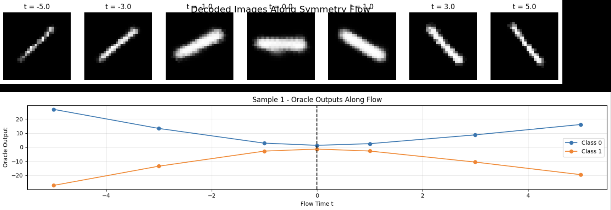
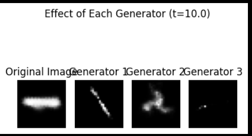

# Symmetry Discovery in Deep Learning

This folder contains implementations for discovering hidden symmetries and conservation laws using deep learning techniques with the MNIST dataset.

## Task Overview

### Task 1: Dataset Preparation and Latent Space Creation
- **Dataset Preparation**: Rotating MNIST digits (focusing on digits 1 and 2) in 30-degree increments
- **Latent Space Creation**: Building and training a Variational Auto-Encoder

### Task 2: Supervised Symmetry Discovery
- Using MLP on the latent space to learn transformations that map vectors to their rotated versions in image space

### Task 3: Unsupervised Symmetry Discovery
- Discovering symmetries in the MNIST dataset that preserve the logit
- Confirming rotation as one of the discovered symmetries

### Bonus Task
- Building a rotation invariant network using the symmetries discovered in the previous tasks

## Implementation Details

### Dataset Preparation
I created a structured HDF5 file to efficiently store the rotated MNIST dataset. For each digit, I generated 12 rotated versions (in steps of 30 degrees from 0° to 330°) of each original image. The data is organized with a hierarchical structure where each digit serves as a key, containing image tensors with dimensions (n, 12, c, h, w), where:

- n: number of original images for that digit
- 12: number of rotation angles (0°, 30°, 60°, ..., 330°)
- c: number of channels (1 for grayscale MNIST)
- h, w: height and width of images

This organization allows for efficient access to specific digits and their rotated variants, facilitating both training of the VAE and subsequent symmetry discovery tasks.

### VAE Architecture
I experimented with several VAE architectures to find the most effective representation for the rotated MNIST digits:

1. **Vanilla Neural Network**: Implemented fully-connected architectures with various hidden dimensions. These models typically produced more linear separations in the latent space.

2. **Small Convolutional Architecture**: Built lightweight CNN-based VAEs with latent dimensions of 2, 16, and 64. The smaller latent spaces (especially dim=2) allowed for better visualization and were more effective for discovering unsupervised rotational symmetry.

3. **Deep Convolutional Architecture**: Developed deeper CNN-based VAEs with the same latent dimension variants (2, 16, 64). These architectures captured more complex features beyond just rotational features and provided better reconstructions, but sometimes obscured the rotational relationships in the latent space.

4. **Rotation Equivariant Model**: Implemented a specialized architecture using the e2cnn library to explicitly enforce rotation equivariance. This approach encoded rotational symmetry directly into the model structure.

The trade-off between latent space interpretability and reconstruction quality was a key consideration. Smaller latent dimensions and simpler CNN architectures proved better for visualizing rotational patterns and discovering unsupervised rotational symmetry, while deeper architectures with larger latent spaces provided higher fidelity reconstructions but captured features beyond just rotation.

### Supervised Learning in Latent Space
For supervised symmetry discovery, I implemented two distinct approaches to learn the rotational transformations in latent space:

1. **Single-Step Transformation**: In this approach, I trained a neural network to operate directly in the latent space. The process involved:
   - Passing the input image through the encoder to get the latent representation
   - Applying reparameterization to the latent vector
   - Transforming the latent vector using the neural network
   - Decoding the transformed latent vector back to image space
   - Computing reconstruction loss between the output and the ground truth rotated image

2. **Iterative Transformation**: In this second approach, I explored a more systematic method:
   - Starting with the latent representation of the original image
   - Passing it through the transformation model 11 times sequentially (to model rotations from 30° to 330°)
   - Decoding the final transformed state (after 11 iterations)
   - Applying reconstruction loss against the ground truth 330° rotated image

This iterative approach tested whether applying the 30° rotation transformation repeatedly would correctly compose to the full 330° rotation, validating that the learned transformation properly captures the underlying rotational symmetry.

### Unsupervised Symmetry Discovery
For the unsupervised discovery of symmetries in the MNIST dataset, I implemented the methodology from the paper [add reference], adapting it to work with rotated MNIST digits and VAEs. The approach consists of four main steps:

#### 1. Dimensionality Reduction with VAE
- **Objective**: Compress high-dimensional image data into a lower-dimensional latent space.
- **Implementation**: Used the previously trained VAE to map input images to latent vectors.
  - **Encoder (E)**: Maps input data x ∈ ℝⁿ to a latent vector z ∈ ℝˡ, where l ≪ n.
  - **Decoder (D)**: Reconstructs the input from the latent vector z.
  - The VAE's structured latent space with probabilistic encoding improved symmetry discovery compared to a standard autoencoder.

#### 2. Oracle Training
- **Objective**: Learn a classifier (oracle) that predicts labels from latent vectors.
- **Implementation**: Trained a neural network ψ̃ : ℝˡ → ℝᵏ on the latent vectors zᵢ = E(xᵢ).
  - The oracle outputs logits for each class label, serving as the invariant function to preserve under symmetry transformations.

#### 3. Symmetry Generator Training
- **Objective**: Discover continuous symmetry transformations in the latent space that preserve the oracle's predictions.
- **Implementation**: 
  - **Infinitesimal Transformation**: Modeled a symmetry generator g(z) as a neural network. The transformation is defined as:
    z' = z + εg(z), where ε is a small scalar.
  - **Loss Functions**:
    - **Invariance Loss**: Ensures transformed latent vectors z' yield the same oracle output:
      L_inv = (1/m) ∑ᵢ [ψ̃(zᵢ + εg(zᵢ)) - ψ̃(zᵢ)]².
    - **Normalization Loss**: Encourages non-trivial transformations by enforcing unit norm and consistency:
      L_norm = (1/m) ∑ᵢ (‖g(zᵢ)‖ - 1)² + Var(‖g(zᵢ)‖).
    - **Orthogonality Loss** (for multiple generators): Ensures distinctness between generators g₁, g₂, ...:
      L_ortho = (1/m) ∑ᵢ ∑_α<β [g_α(zᵢ) · g_β(zᵢ)]².
    - **Closure Loss** (optional): Tests if generators form a closed Lie algebra by checking commutators [g_α, g_β].

#### 4. Validation and Visualization
- **Objective**: Verify learned symmetries and interpret their effects.
- **Steps**:
  - Applied transformations g(z) to latent vectors of input data.
  - Decoded transformed latent vectors z' back to pixel space using D(z') to visualize transformed images.
  - Confirmed that transformed images retained their original labels (invariance) despite visual changes (rotation).
  - Used streamlines in latent space to illustrate symmetry flows (trajectories that preserve class identity).

#### Key Adaptation
- **VAE vs. Standard Autoencoder**: The use of a VAE introduced probabilistic latent variables and regularization, yielding a more structured and disentangled latent space. This influenced the robustness of symmetries discovered compared to the original paper's autoencoder.

This methodology successfully discovered non-trivial continuous symmetries (specifically rotation) in the dataset while preserving label invariance.

### Rotation Invariant Network
For the bonus task of building a rotation invariant network, I implemented an approach that leverages the previously learned transformations in latent space:

1. **Latent Space Encoding**:
   - Encoded input images to obtain their latent representations z
   - Applied reparameterization to these latent vectors

2. **Rotational Averaging**:
   - Applied the transformation model 11 consecutive times to simulate all rotation angles (30°, 60°, ..., 330°)
   - Computed the average of all these transformed latent vectors

   This averaging approach ensures rotational invariance because:
   - The resulting representation contains information from all possible rotations
   - The average vector remains the same regardless of the initial rotation of the input
   - All rotational variants of the same digit map to approximately the same point in latent space

3. **Classification**:
   - Trained a classifier on these averaged latent representations
   - The classifier demonstrates invariance to rotation, as it produces consistent predictions regardless of the input image's orientation

This approach effectively transforms the standard classification problem into a rotation-invariant one by preprocessing in the latent space rather than requiring architectural changes to the classifier itself.

## Results

### Oracle Classifier score
0.995 highest accracy for 2 digits

0.935 highest for all 10 digits

0.9 highest for the rotation invarient 

### Rotation Invariance Performance
0.9 chighest lassifiction score for the rotation invarient 

## References
- [Oracle-Preserving Latent Flows](https://arxiv.org/abs/2302.00806)
- [VAE blog](https://www.ibm.com/think/topics/variational-autoencoder#:~:text=Variational%20autoencoders%20(VAEs)%20are%20generative,data%20they're%20trained%20on.)